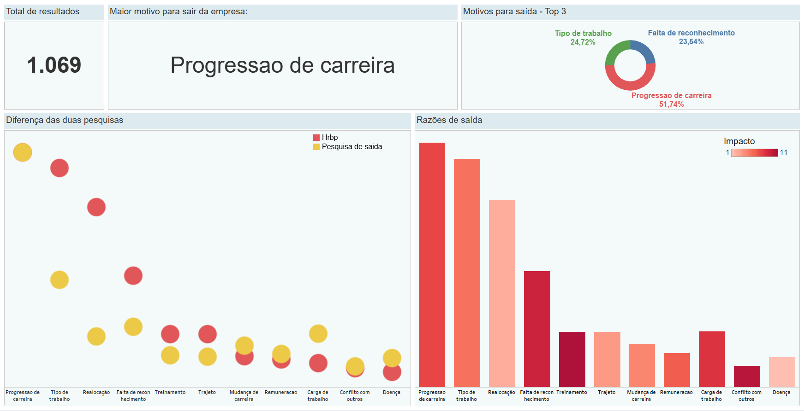

# **Projeto Individual - Modulo 5** 🎯

Neste projeto iremos coletar, tratar e analisar os dados que foram realizados por pesquisas internas da empresa, para saber quais são as razões pela qual os colaboradores estão deixando a empresa.

Abordaremos como a falta de um plano de carreira para os colaboradores afeta nas decisões de saída da empresa e como podemos resolver esse problema, e consequentemente reter futuros e atuais talentos na empresa. Também veremos quais foram os motivos que mais foram frequêntes nos resultados das pesquisas e seus impactos na hora de decidir sair da empresa.

**Nesse relatório teremos:**

- Analisar e explicar os gráficos apresentados trazendo insights necessários para resolver o problema proposto.
- O que não é ideal nos gráficos apresentados e o que poderia ser evitados nas visualizações.
- Criar maneiras diferentes de vizualizar o gráfico, para um possível melhor entendimento utilizando o **Tableau**.
- Criar um storytelling para os dados apresentados mostrando o contexto da história.

⭐ **Você pode acessar o dashboard desse projeto [clicando aqui](https://public.tableau.com/views/projetoindividualmod5dash/Painel1?:language=pt-BR&publish=yes&:display_count=n&:origin=viz_share_link).**

## Tecnologias Utilizadas 💻

   

## Conteúdos do Repositório 📁

Neste repositório, você vai encontrar:

> Uma pasta chamada **data** que possui os arquivos excel (.xlsx) da base de dados utilizado para a análise;
>
> Uma pasta chamada **img** que contém imagens dos gráficos para o relatório;
>
> Um Notebook chamado **relatorio.ipynb** que contém o projeto de EDA em si.

## Contatos 📧

Quer me mandar uma mensagem? Tem dicas e conselhos de melhoria e aprimoramento do projeto? Você pode entrar em contato comigo por e-mail ou acessando meu perfil do LinkedIn, estou sempre por lá!

e-mail: gideonidev@gmail.com

LinkedIn: 